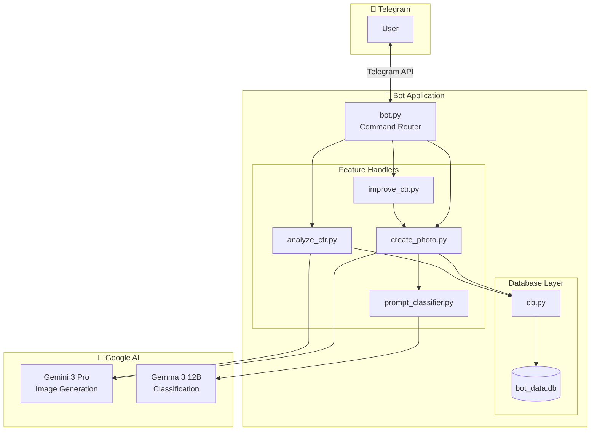
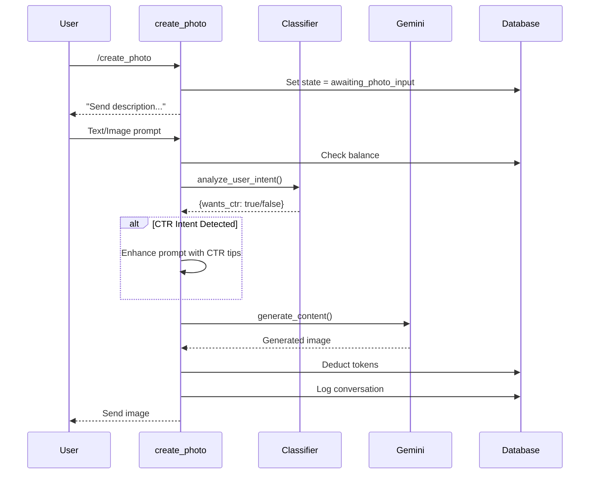
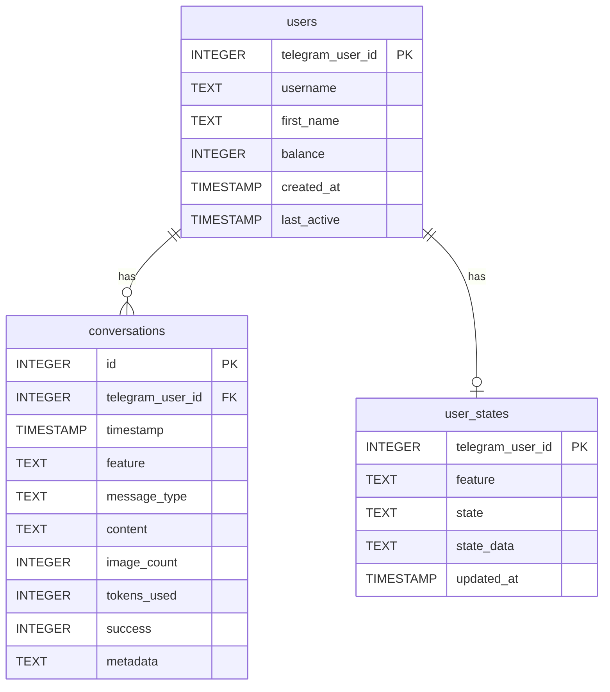
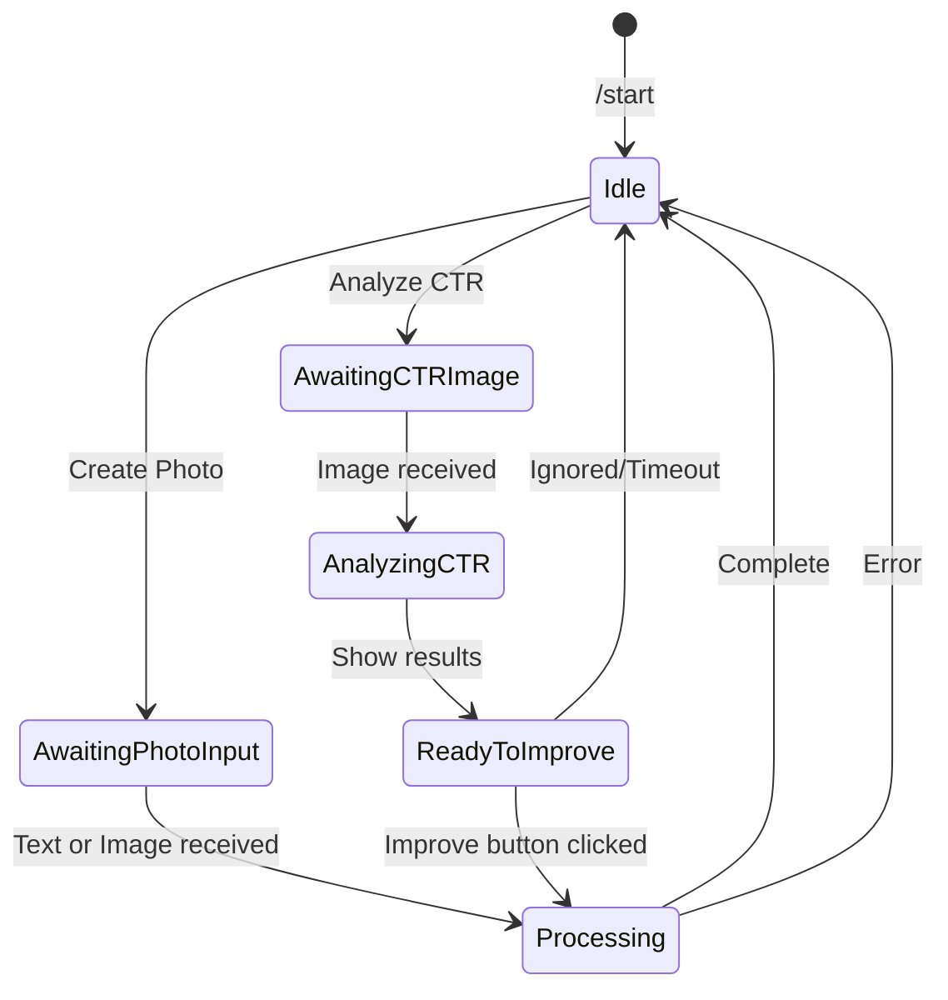

# 🏗️ System Architecture

This document describes the technical architecture of Nano Banana Bot.

---

## High-Level Architecture



---

## Component Details

### 1. Main Entry Point (`bot.py`)

The central orchestrator that:
- Initializes the Telegram bot application
- Sets up command and message handlers
- Routes incoming updates to appropriate handlers
- Manages the callback query routing for inline buttons

**Key Functions:**
| Function | Purpose |
|----------|---------|
| `start()` | Display main menu with inline buttons |
| `button_callback()` | Route inline button clicks to handlers |
| `handle_message()` | Route text messages based on user state |
| `handle_photo()` | Route photo messages based on user state |
| `show_balance()` | Display user's token balance |
| `support()` | Show support contact information |

### 2. Handlers Module

#### `create_photo.py`
Handles AI image generation with these capabilities:
- Text-only image generation
- Image + text editing/generation
- Multi-image input support (up to 5 images)
- Automatic CTR enhancement when detected
- Animated loading indicators

**Flow:**


#### `analyze_ctr.py`
Analyzes product card images for CTR potential:
- Scores images on a 1-10 scale
- Identifies strengths and weaknesses
- Provides concrete recommendations
- Offers one-click improvement button

**Analysis Criteria:**
- Title/text readability
- Product visibility
- Color contrast
- USP presence (discounts, shipping)
- Image quality
- Marketplace trend compliance

#### `improve_ctr.py`
Bridges analysis and generation:
- Retrieves stored analysis recommendations
- Extracts actionable improvement points
- Generates optimized image using recommendations

#### `prompt_classifier.py`
Lightweight intent classification:
- Uses Gemma 3 12B (text-only model)
- Zero temperature for consistent results
- Determines if user wants CTR optimization
- Runs only when images are provided

### 3. Database Layer (`database/db.py`)

SQLite-based persistence with three tables:

#### Schema Overview



#### Key Functions

**User Management:**
- `get_or_create_user()` — Upsert user record
- `get_user()` — Retrieve user by ID
- `update_user_balance()` — Modify balance
- `check_balance()` — Verify sufficient funds
- `deduct_balance()` — Subtract tokens for operation

**State Management:**
- `get_user_state()` — Get current user state
- `set_user_state()` — Set/update user state (UPSERT)
- `clear_user_state()` — Remove user state

**Logging:**
- `log_conversation()` — Record all interactions

---

## AI Models

### Gemini 3 Pro Image Preview
- **Purpose:** Image generation and editing
- **Model ID:** `gemini-3-pro-image-preview`
- **Capabilities:**
  - Text-to-image generation
  - Image editing with instructions
  - Multi-image composition
  - High-resolution output

### Gemma 3 12B
- **Purpose:** Intent classification
- **Model ID:** `gemma-3-12b-it`
- **Configuration:**
  - Temperature: 0 (deterministic)
  - Max tokens: 10
- **Use Case:** Quick yes/no classification for CTR intent

---

## State Machine

The bot uses a state machine pattern for multi-step interactions:



**States:**
| Feature | State | Description |
|---------|-------|-------------|
| create_photo | awaiting_photo_input | Waiting for text/image |
| analyze_ctr | awaiting_ctr_image | Waiting for image |
| ctr_improvement | ready_to_improve | Can click improve button |

---

## Loading Animations

Both main features use animated loading indicators:

```python
# Emoji cycle for create_photo
PHOTO_LOADING_EMOJIS = ["🤔", "💡", "🎨"]

# Emoji cycle for analyze_ctr
CTR_LOADING_EMOJIS = ["🔍", "✍️", "📝"]
```

**Animation Flow:**
1. Send message with first emoji
2. Edit message to next emoji (every 2.9s)
3. After full cycle, delete message
4. Repeat until processing complete
5. On completion, cancel task and cleanup

---

## Error Handling

The bot implements graceful error handling:

1. **Balance Errors** — Clear user state, inform user
2. **API Errors** — Log error, notify user, continue
3. **Markdown Parse Errors** — Fallback to plain text
4. **File Size Errors** — Reject oversized images with message
5. **Animation Errors** — Silently ignore (non-critical)

All errors are:
- Logged with full traceback
- Recorded in conversations table
- Communicated to user in friendly language

---

## Security Considerations

| Area | Implementation |
|------|----------------|
| API Keys | Environment variables, never committed |
| User Data | Local SQLite, not transmitted externally |
| State | Database-backed, survives restarts |
| Input Validation | Image size limits, state verification |
| Error Messages | Generic to users, detailed in logs |
